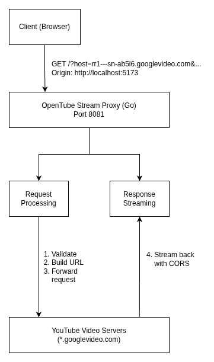
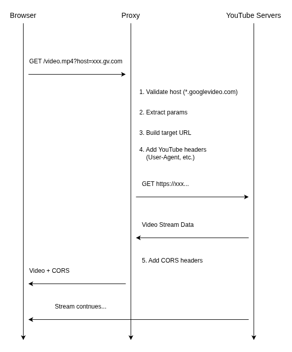

# OpenTubeStreamProxy

High-performance Go-based reverse proxy service for streaming video segments from Youtube's servers to the OpenTube frontend 
with CORS support.

## Purpose

The Stream Proxy solves a critical problem in browser-based video streaming: **Cross-Origin Resource Sharing (CORS) 
restrictions**. YouTube's video servers (`googlevideo.com`) don't include CORS headers, which prevents web browsers from 
directly fetching video segments. This proxy acts as an intermediary that:

 1. Accepts requestsfrom the OpenTube frontend
 2. Forwards them to YouTube video servers with proper headers
 3. Adds CORS headers to the response
 4. Streams the video data back to the client

## Archiectecture Overview



## Request Flow



## Features
 - **CORS Support**: Adds necessary CORS headers to allow cross-origin requests
 - **Effcient Streaming**: Uses `io.Copy` for effcient, zero-copy streaming
 - **YouTube Header Emulation**: Sends headers that YouTube expects
 - **Preflight Request Handling**: Properly handles CORS preflight (OPTIONS) requests

## API Reference

### Endpoint

**URL:** `http://localhost:8081/`

**Method:** `GET`

**Query Parameters:**

| Parameter | Required | Description | Example |
|-----------|----------|-------------|---------|
| `host` | Yes | YouTube video server hostname | `rr1---sn-ab5l6n7s.googlevideo.com` |
| `id` | No* | Video identifier | `BaW_jenozKc` |
| `itag` | No* | Stream format identifier | `137` |
| `range` | No | Byte range for partial content | `0-1048575` |
| All other YouTube params | No* | Passed through to YouTube | Various |

\* *Required by YouTube's video servers, but proxy passes them through*

### Example Request

```bash
curl "http://localhost:8081/?host=rr1---sn-ab5l6n7s.googlevideo.com&id=BaW_jenozKc&itag=137&source=youtube&requiressl=yes&range=0-1048575"
```

### Example Usage in JavaScript

```javascript
// Frontend video player request
const proxyUrl = 'http://localhost:8081/';
const videoUrl = 'https://rr1---sn-ab5l6n7s.googlevideo.com/videoplayback?id=...&itag=...';

// Extract host and params
const url = new URL(videoUrl);
const host = url.hostname;
const params = url.searchParams;

// Build proxied request
const proxiedUrl = `${proxyUrl}?host=${host}&${params.toString()}`;

// Use in video player
player.load(proxiedUrl);
```

## Getting Started

### Prerequisites

- Go 1.21 or higher
- No external dependencies (uses only standard library)

### Installation

```bash
# Clone the repository
git clone https://github.com/yourusername/OpenTubeStreamProxy.git
cd OpenTubeStreamProxy

# No dependencies to install - uses only Go standard library!
```

### Running the Proxy

#### Development Mode

```bash
# Run directly
go run main.go

# With custom port (requires code modification)
# Edit main.go: port := "8082"
go run main.go
```
